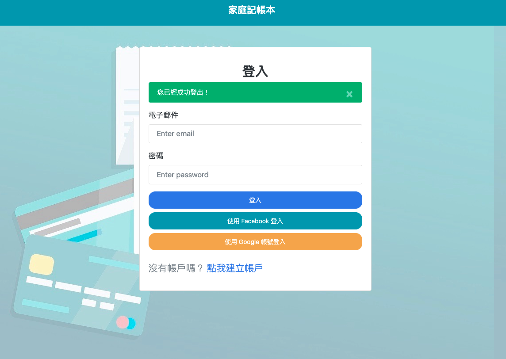
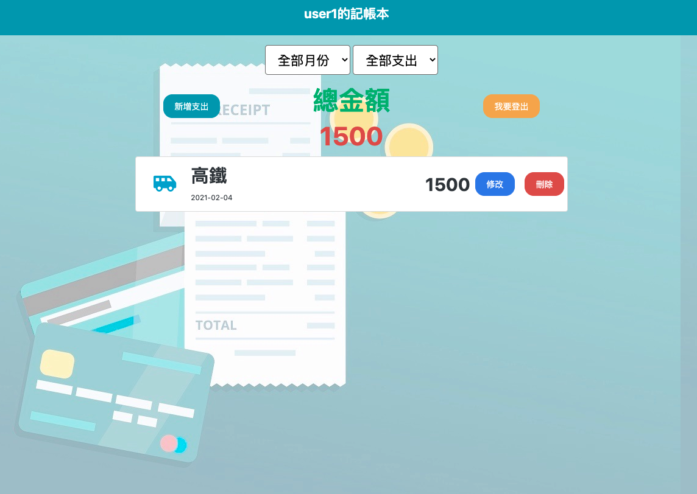

# 老爸的私房錢 v2.0

這是個專門給老爸私房錢記帳用的專案作品

### Login page


### home page


## 環境設定
- npm
- nodemon
- node.js
- Robo 3T
- MongoDB

## 套件使用
- express
- express-handlebars
- express-session
- body-parser
- method-override
- Mongoose
- bcryptjs
- passport, local, facebook
- dotenv
- connect-flash

## 功能
- 使用者可以瀏覽全部的支出項目以及花費總金額
- 使用者可以依照支出的類別查看以及花費總金額
- 使用者可以編輯某個項目的資料
- 使用者可以刪除某個項目的資料
- 使用者可以新增某個項目的資料

## 2021/01/18 更新 Update
- 新增使用者登入驗證功能
- 新增商家紀錄欄位
- 新增月份篩選查看花費總金額

## 安裝
先打開終端機，輸入以下指令進行下載：
```bash
git clone https://github.com/Subaruuuu/expense-tracker.git
```

輸入以下指令進入到下載的資料夾內，並進行安裝：
```bash
cd expense-tracker
npm install
```
安裝結束後，執行 npm 指令：
```bash
npm run seed & npm run dev
```

建立種子資料後，可以使用以下使用者來登入查看：

使用者一號:
- email: user1@example.com
- password: 12345678

使用者二號:
- email: user2@example.com
- password: 12345678


可以至 "http://localhost:3000" 查看專案內容

## Contributor

[Oscar Hung](https://github.com/Subaruuuu)